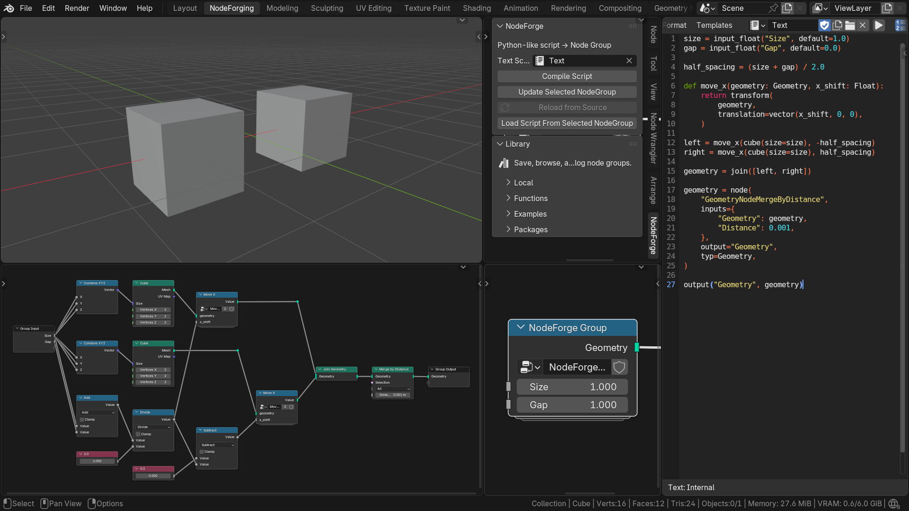

# NodeForge



> **Disclaimer:** NodeForge is a vibe-coded project.

NodeForge is a Blender add-on for describing Geometry Nodes logic in a Python-like language. The source is compiled into a native Geometry Nodes group, so the result inside Blender is an ordinary node graph with the expected sockets, links and parameters.

## Installation

1. Download the latest `NodeForge-<version>-blender.zip` from the [**GitHub release**](https://github.com/denikryt/NodeForge/releases) section.
2. In Blender, open **Edit → Preferences → Add-ons**.
3. Open the Add-ons menu, choose **Install from Disk...**, and select the downloaded ZIP file.
4. Enable **NodeForge** in the add-on list.

## Quick start

1. Select a mesh object and open the **Geometry Node Editor**.
2. Click **New** to create a Geometry Nodes modifier and node tree for the object.
3. Press `N` and open the **NodeForge** tab in the sidebar.
4. Open a **Text Editor**, click **New**, and enter this script:

```python
size = input_float("Size", default=2.0)
geo = cube(size=size)
output("Geometry", geo)
```

5. Return to the NodeForge sidebar and select the new text in **Text Script**.
6. Click **Compile Script**. NodeForge adds the generated group node to the current Geometry Nodes tree.
7. Connect the generated node's **Geometry** output to the **Group Output** node to display the cube.

To change the generated group, edit the text, select the generated group node, and click **Update Selected NodeGroup**. NodeForge recompiles the script into the same node group and preserves compatible links and input values.

See the [Get Started guide](https://denikryt.github.io/NodeForgeDocs/latest/GET_STARTED/) for the complete beginner workflow.

## The language at a glance

A small script can mix group inputs, ordinary expressions, built-in Geometry Nodes wrappers, local functions, and direct access to Blender nodes:

```python
size = input_float("Size", default=1.0)
gap = input_float("Gap", default=0.0)

half_spacing = (size + gap) / 2.0

def move_x(geometry: Geometry, x_shift: Float):
    return transform(
        geometry,
        translation=vector(x_shift, 0, 0),
    )

left = move_x(cube(size=size), -half_spacing)
right = move_x(cube(size=size), half_spacing)

geometry = join([left, right])

geometry = node(
    "GeometryNodeMergeByDistance",
    inputs={
        "Geometry": geometry,
        "Distance": 0.001,
    },
    output="Geometry",
    typ=Geometry,
)

output("Geometry", geometry)
```

`input_*` declarations become node-group input sockets and return values that can be used like variables. Operators such as `+`, `/`, and unary `-` are type-checked and materialized as native Geometry Nodes operations. Built-ins such as `cube(...)`, `join(...)`, and `transform(...)` provide compact wrappers around common Geometry Nodes functionality.

A script-local `def` is compiled as a reusable function Node Group. In the example above, both calls to `move_x(...)` use that function group while the two cubes move symmetrically away from the world origin as `Gap` increases.

`node(...)` is the universal low-level form for Blender nodes that do not have a dedicated NodeForge wrapper. Here it creates **Merge by Distance** directly while the rest of the script stays in the higher-level DSL.

The language is intended to make procedural logic easier to express and maintain as the graph grows. Mathematical relationships can be written directly as expressions, while Geometry Nodes operations remain visible through functions that fit naturally into Python-like code. 

NodeForge scripts can call reusable functions and can be extended through installable third-party packages. This allows project-specific operations and larger procedural components to become part of the language used by other scripts.

## Additional libraries

- **NodeForge Math** adds math operations, reusable functions, and examples. Download the package ZIP from the [NodeForge release section](https://github.com/denikryt/NodeForge/releases/latest), or browse its [source repository](https://github.com/denikryt/nodeforge.math).
- **NodeForge L-System** adds tools for procedural L-system generation. [Download](https://www.patreon.com/nachitima/posts/nodeforge-l-v2-0-169730745)

Install a library ZIP from the **Packages** section of the NodeForge tab in the Geometry Nodes Editor. Enable **Allow executable Python** when the package requires Python support.

Installed package APIs are imported through the package namespace:

```python
from packages import math

angle = input_float("Angle", default=0.0)
value = math.sin(angle)
output("Value", value)
```

Reusable Local scripts can be imported with `from local import ...`.

## Coverage

The syntax follows Python as closely as the Geometry Nodes model allows. The built-in function library covers only part of Geometry Nodes. When a dedicated NodeForge function is not available, `node(...)` can create the Blender node directly.

See the [Geometry Nodes coverage](https://denikryt.github.io/NodeForgeDocs/latest/GEOMETRY_NODES_COVERAGE/) page for the current feature matrix and the [Core DSL Built-ins](https://denikryt.github.io/NodeForgeDocs/latest/BUILTINS/) reference for the complete `node(...)` syntax.

### How the compiler works

Internally, NodeForge parses the source, resolves its types and operations, builds a semantic intermediate representation, and lowers that representation into Blender nodes. The compiler owns the translation from source-level logic to the final `GeometryNodeTree`, keeping the language-facing part of the system separate from Blender graph construction.

```text
NodeForge source
    ↓
Python AST
    ↓
semantic analysis and NFType checking
    ↓
typed Semantic IR
    ↓
Blender lowering and materialization
    ↓
GeometryNodeTree
```

### Learn more in the documentation:
https://denikryt.github.io/NodeForgeDocs/

### Support the developer:
https://www.patreon.com/c/nachitima
